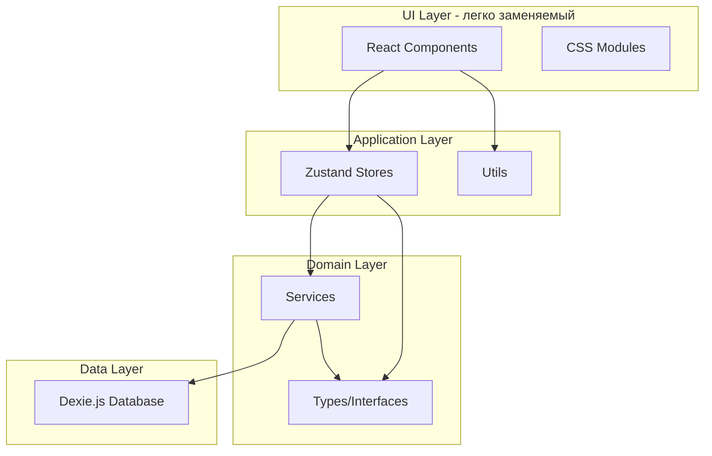

# План модернизации VDN (Functionality First)

## Принцип разработки

```
Функциональность → Тестирование → UI
```

UI слой должен быть **легко заменяемым**. Для этого:

- UI зависит только от store интерфейсов
- Бизнес-логика изолирована в services
- Четкое разделение на слои с односторонними зависимостями

## Архитектура



**Зависимости только сверху вниз** - UI не знает о БД напрямую.

## Обзор изменений

| Компонент | Было | Станет |
|-----------|------|--------|
| Сборщик | Create React App | Vite 6.x |
| Линтер | ESLint | Biome |
| State | Context API | Zustand |
| IndexedDB | idb | Dexie.js |
| Типизация | Частичный TS | Полный TypeScript |
| UI | Material-UI v4 | Radix UI + CSS Modules |
| React | v16.10.2 | v19.2.1+ (CVE-2025-55182 fix) |

## Структура проекта

```
src/
├── main.tsx                    # Точка входа
├── App.tsx                     # Корневой компонент
├── vite-env.d.ts
│
├── types/                      # Фаза 2: Типы
│   ├── index.ts                # Реэкспорт всех типов
│   ├── video.ts                # Video, VideoInput
│   ├── note.ts                 # Note, NoteInput  
│   ├── settings.ts             # Setting, AppSettings
│   └── store.ts                # Store interfaces
│
├── db/                         # Фаза 3: Data Layer
│   ├── database.ts             # Dexie.js класс БД
│   ├── seed.ts                 # Демо-данные
│   └── index.ts
│
├── services/                   # Фаза 3: Domain Services
│   ├── videoService.ts         # CRUD для видео
│   ├── noteService.ts          # CRUD для заметок
│   ├── settingsService.ts      # Работа с настройками
│   └── index.ts
│
├── store/                      # Фаза 4: Application State
│   ├── useVideoStore.ts        # Состояние видео
│   ├── useNotesStore.ts        # Состояние заметок
│   ├── useAppStore.ts          # UI состояние
│   └── index.ts
│
├── utils/                      # Фаза 4: Утилиты
│   ├── formatTime.ts
│   ├── exportFormatters.ts
│   ├── videoUrl.ts
│   ├── clipboard.ts
│   └── index.ts
│
├── components/                 # Фаза 6: UI (последний этап)
│   ├── NavBar/
│   ├── Sidebar/
│   ├── Video/
│   ├── Notes/
│   ├── Layout/
│   └── Dialog/
│
└── styles/                     # Фаза 6: Стили
    ├── global.css
    └── variables.css
```

---

## Фаза 1: Инициализация проекта

### Задачи

1. Инициализировать Vite проект с React 19 + TypeScript
2. Настроить Biome для линтинга и форматирования
3. Настроить path aliases в tsconfig и vite.config
4. Установить базовые зависимости (без UI библиотек пока)

### Конфигурационные файлы

**vite.config.ts:**

```typescript
import { defineConfig } from 'vite';
import react from '@vitejs/plugin-react';
import path from 'path';

export default defineConfig({
  plugins: [react()],
  resolve: {
    alias: {
      '@': path.resolve(__dirname, './src'),
      '@types': path.resolve(__dirname, './src/types'),
      '@db': path.resolve(__dirname, './src/db'),
      '@services': path.resolve(__dirname, './src/services'),
      '@store': path.resolve(__dirname, './src/store'),
      '@utils': path.resolve(__dirname, './src/utils'),
      '@components': path.resolve(__dirname, './src/components'),
    },
  },
});
```

**biome.json:**

```json
{
  "$schema": "https://biomejs.dev/schemas/1.9.4/schema.json",
  "organizeImports": { "enabled": true },
  "linter": {
    "enabled": true,
    "rules": { "recommended": true }
  },
  "formatter": {
    "enabled": true,
    "indentStyle": "tab",
    "lineWidth": 100
  }
}
```

### Зависимости (минимальные для начала)

> **Security:** React 19.2.1+ из-за [CVE-2025-55182](https://www.cve.org/CVERecord?id=CVE-2025-55182) (React2Shell)

```json
{
  "dependencies": {
    "react": "^19.2.1",
    "react-dom": "^19.2.1",
    "zustand": "^5.0.0",
    "dexie": "^4.0.10"
  },
  "devDependencies": {
    "@biomejs/biome": "^1.9.4",
    "@types/react": "^19.0.0",
    "@types/react-dom": "^19.0.0",
    "@vitejs/plugin-react": "^4.3.4",
    "typescript": "^5.7.2",
    "vite": "^6.0.3"
  }
}
```

---

## Фаза 2: Типы и интерфейсы ✅

> **Статус:** Реализовано (2025-12-17)
> 
> Все типы и интерфейсы созданы и соответствуют плану. Документация по обоснованию использования интерфейсов: `docs/types-design-rationale.md`

### types/video.ts

```typescript
export interface Video {
  url: string;        // Primary key
  title: string;
}

export interface VideoInput {
  url: string;
  title: string;
}
```

### types/note.ts

```typescript
export interface Note {
  id?: number;        // Auto-increment
  url: string;        // Foreign key к Video
  title: string;      // Текст заметки
  time: number;       // Время в секундах
}

export interface NoteInput {
  url: string;
  title: string;
  time: number;
}
```

### types/settings.ts

```typescript
export interface Setting {
  name: string;       // Primary key
  value: string | number | boolean;
}

export interface AppSettings {
  currentVideo: string;
  timeOffset: number;
  exportHtml: boolean;
  exportMd: boolean;
  exportTxt: boolean;
}
```

### types/store.ts

```typescript
import type { Note, Video } from '@types';

// Интерфейсы для store - UI зависит только от них
export interface VideoStoreState {
  currentVideoUrl: string;
  isPlaying: boolean;
  videos: Video[];
}

export interface VideoStoreActions {
  setCurrentVideo: (url: string) => Promise<void>;
  setPlaying: (playing: boolean) => void;
  loadVideos: () => Promise<void>;
  addVideo: (url: string, title: string) => Promise<void>;
  removeVideo: (url: string) => Promise<void>;
  editVideo: (url: string, title: string) => Promise<void>;
}

export interface NotesStoreState {
  notes: Note[];
}

export interface NotesStoreActions {
  loadNotes: (url: string) => Promise<void>;
  addNote: (title: string, time: number) => Promise<void>;
  removeNote: (id: number) => Promise<void>;
  editNote: (id: number, title: string) => Promise<void>;
}

export interface AppStoreState {
  sidebarOpen: boolean;
}

export interface AppStoreActions {
  setSidebarOpen: (open: boolean) => void;
  toggleSidebar: () => void;
}
```

---

## Фаза 3: Data Layer (Dexie.js) + Services

### db/database.ts

```typescript
import Dexie, { type Table } from 'dexie';
import type { Video, Note, Setting } from '@types';

export class VdnDatabase extends Dexie {
  videos!: Table<Video, string>;      // string = тип primary key
  notes!: Table<Note, number>;        // number = auto-increment id
  settings!: Table<Setting, string>;

  constructor() {
    super('VDN');
    
    this.version(1).stores({
      videos: 'url, title',           // url = primary key
      notes: '++id, url, time',       // ++id = auto-increment
      settings: 'name'                // name = primary key
    });
  }
}

export const db = new VdnDatabase();
```

### services/videoService.ts

```typescript
import { db } from '@db';
import type { Video, VideoInput } from '@types';

export const videoService = {
  async getAll(): Promise<Video[]> {
    return db.videos.toArray();
  },

  async add(input: VideoInput): Promise<void> {
    await db.videos.add(input);
  },

  async remove(url: string): Promise<void> {
    await db.transaction('rw', [db.videos, db.notes], async () => {
      await db.videos.delete(url);
      await db.notes.where('url').equals(url).delete();
    });
  },

  async update(url: string, title: string): Promise<void> {
    await db.videos.update(url, { title });
  },

  async exists(url: string): Promise<boolean> {
    const video = await db.videos.get(url);
    return !!video;
  }
};
```

### services/noteService.ts

```typescript
import { db } from '@db';
import type { Note, NoteInput } from '@types';

export const noteService = {
  async getByUrl(url: string): Promise<Note[]> {
    return db.notes.where('url').equals(url).sortBy('time');
  },

  async getAll(): Promise<Note[]> {
    return db.notes.toArray();
  },

  async add(input: NoteInput): Promise<number> {
    return db.notes.add(input as Note);
  },

  async remove(id: number): Promise<void> {
    await db.notes.delete(id);
  },

  async update(id: number, title: string): Promise<void> {
    await db.notes.update(id, { title });
  }
};
```

### services/settingsService.ts

```typescript
import { db } from '@db';
import type { Setting, AppSettings } from '@types';

const DEFAULT_SETTINGS: AppSettings = {
  currentVideo: 'https://youtu.be/cCOL7MC4Pl0',
  timeOffset: 3,
  exportHtml: true,
  exportMd: true,
  exportTxt: true,
};

export const settingsService = {
  async get<K extends keyof AppSettings>(name: K): Promise<AppSettings[K]> {
    const setting = await db.settings.get(name);
    return (setting?.value as AppSettings[K]) ?? DEFAULT_SETTINGS[name];
  },

  async set<K extends keyof AppSettings>(name: K, value: AppSettings[K]): Promise<void> {
    await db.settings.put({ name, value });
  },

  async getCurrentVideo(): Promise<string> {
    return this.get('currentVideo');
  },

  async setCurrentVideo(url: string): Promise<void> {
    await this.set('currentVideo', url);
  },

  async getTimeOffset(): Promise<number> {
    return this.get('timeOffset');
  }
};
```

### db/seed.ts

```typescript
import { db } from './database';
import type { Video, Note, Setting } from '@types';

const DEMO_VIDEO: Video = {
  url: 'https://youtu.be/cCOL7MC4Pl0',
  title: 'Demo Video - React Tutorial'
};

const DEMO_NOTES: Omit<Note, 'id'>[] = [
  { url: DEMO_VIDEO.url, title: 'Introduction to React', time: 0 },
  { url: DEMO_VIDEO.url, title: 'Components and Props', time: 120 },
  { url: DEMO_VIDEO.url, title: 'State Management', time: 300 },
];

const DEFAULT_SETTINGS: Setting[] = [
  { name: 'currentVideo', value: DEMO_VIDEO.url },
  { name: 'timeOffset', value: 3 },
  { name: 'exportHtml', value: true },
  { name: 'exportMd', value: true },
  { name: 'exportTxt', value: true },
];

export async function seedDatabase(): Promise<void> {
  const videoCount = await db.videos.count();
  
  if (videoCount === 0) {
    await db.transaction('rw', [db.videos, db.notes, db.settings], async () => {
      await db.videos.add(DEMO_VIDEO);
      await db.notes.bulkAdd(DEMO_NOTES as Note[]);
      await db.settings.bulkAdd(DEFAULT_SETTINGS);
    });
    console.log('Database seeded with demo data');
  }
}
```

---

## Фаза 4: Zustand Stores + Утилиты

### store/useVideoStore.ts

```typescript
import { create } from 'zustand';
import { videoService, settingsService } from '@services';
import type { Video, VideoStoreState, VideoStoreActions } from '@types';

type VideoStore = VideoStoreState & VideoStoreActions;

export const useVideoStore = create<VideoStore>((set, get) => ({
  // State
  currentVideoUrl: '',
  isPlaying: false,
  videos: [],

  // Actions
  setCurrentVideo: async (url: string) => {
    await settingsService.setCurrentVideo(url);
    set({ currentVideoUrl: url, isPlaying: false });
  },

  setPlaying: (playing: boolean) => {
    set({ isPlaying: playing });
  },

  loadVideos: async () => {
    const videos = await videoService.getAll();
    const currentUrl = await settingsService.getCurrentVideo();
    set({ videos, currentVideoUrl: currentUrl });
  },

  addVideo: async (url: string, title: string) => {
    await videoService.add({ url, title });
    await settingsService.setCurrentVideo(url);
    await get().loadVideos();
    set({ currentVideoUrl: url });
  },

  removeVideo: async (url: string) => {
    await videoService.remove(url);
    const defaultUrl = 'https://youtu.be/cCOL7MC4Pl0';
    await settingsService.setCurrentVideo(defaultUrl);
    await get().loadVideos();
    set({ currentVideoUrl: defaultUrl });
  },

  editVideo: async (url: string, title: string) => {
    await videoService.update(url, title);
    await get().loadVideos();
  },
}));
```

### store/useNotesStore.ts

```typescript
import { create } from 'zustand';
import { noteService, settingsService } from '@services';
import { useVideoStore } from './useVideoStore';
import type { Note, NotesStoreState, NotesStoreActions } from '@types';

type NotesStore = NotesStoreState & NotesStoreActions;

export const useNotesStore = create<NotesStore>((set, get) => ({
  // State
  notes: [],

  // Actions
  loadNotes: async (url: string) => {
    const notes = await noteService.getByUrl(url);
    set({ notes });
  },

  addNote: async (title: string, time: number) => {
    const url = useVideoStore.getState().currentVideoUrl;
    const timeOffset = await settingsService.getTimeOffset();
    const adjustedTime = Math.max(0, time - timeOffset);
    
    await noteService.add({ url, title, time: adjustedTime });
    await get().loadNotes(url);
  },

  removeNote: async (id: number) => {
    const url = useVideoStore.getState().currentVideoUrl;
    await noteService.remove(id);
    await get().loadNotes(url);
  },

  editNote: async (id: number, title: string) => {
    const url = useVideoStore.getState().currentVideoUrl;
    await noteService.update(id, title);
    await get().loadNotes(url);
  },
}));
```

### store/useAppStore.ts

```typescript
import { create } from 'zustand';
import type { AppStoreState, AppStoreActions } from '@types';

type AppStore = AppStoreState & AppStoreActions;

export const useAppStore = create<AppStore>((set) => ({
  // State
  sidebarOpen: false,

  // Actions
  setSidebarOpen: (open: boolean) => set({ sidebarOpen: open }),
  toggleSidebar: () => set((state) => ({ sidebarOpen: !state.sidebarOpen })),
}));
```

### utils/formatTime.ts

```typescript
export function formatTime(seconds: number): string {
  const totalSeconds = Math.floor(seconds);
  const h = Math.floor(totalSeconds / 3600);
  const m = Math.floor((totalSeconds % 3600) / 60);
  const s = totalSeconds % 60;

  const pad = (n: number) => n.toString().padStart(2, '0');
  return `${pad(h)}:${pad(m)}:${pad(s)}`;
}

export function parseTime(timeString: string): number {
  const parts = timeString.split(':').map(Number);
  if (parts.length === 3) {
    return parts[0] * 3600 + parts[1] * 60 + parts[2];
  }
  return 0;
}
```

### utils/videoUrl.ts

```typescript
export function getVideoUrlWithTime(url: string, time: number): string {
  const seconds = Math.round(time);

  if (url.includes('youtu')) {
    const videoId = url.split('be/')[1] || url.split('v=')[1]?.split('&')[0];
    return `https://www.youtube.com/watch?t=${seconds}&v=${videoId}`;
  }

  if (url.includes('vimeo')) {
    const videoId = url.split('com/')[1];
    return `https://vimeo.com/${videoId}#t=${seconds}`;
  }

  return url;
}

export function isValidVideoUrl(url: string): boolean {
  return /youtu\.?be|vimeo/.test(url);
}
```

### utils/exportFormatters.ts

```typescript
import type { Note } from '@types';
import { formatTime } from './formatTime';
import { getVideoUrlWithTime } from './videoUrl';

export function formatToHtml(notes: Note[]): string {
  const items = notes.map(({ time, title, url }) => {
    const timecode = formatTime(time);
    const videoUrl = getVideoUrlWithTime(url, time);
    return `\t<li><a href="${videoUrl}">${timecode} ${title}</a></li>`;
  });

  return ['<ul>', ...items, '</ul>'].join('\n');
}

export function formatToMarkdown(notes: Note[]): string {
  const lines: string[] = [];
  const links: string[] = [];

  notes.forEach(({ time, title, url }) => {
    const timecode = formatTime(time);
    const videoUrl = getVideoUrlWithTime(url, time);
    lines.push(`- [\`${timecode}\`] ${title}`);
    links.push(`[\`${timecode}\`]: ${videoUrl}`);
  });

  return [...lines, '', ...links].join('\n');
}

export function formatToText(notes: Note[]): string {
  return notes
    .map(({ time, title, url }) => {
      const timecode = formatTime(time);
      const videoUrl = getVideoUrlWithTime(url, time);
      return `${timecode} ${title} ${videoUrl}`;
    })
    .join('\n');
}
```

### utils/clipboard.ts

```typescript
export async function copyToClipboard(text: string): Promise<boolean> {
  try {
    await navigator.clipboard.writeText(text);
    return true;
  } catch {
    // Fallback для старых браузеров
    const textarea = document.createElement('textarea');
    textarea.value = text;
    textarea.style.position = 'fixed';
    textarea.style.opacity = '0';
    document.body.appendChild(textarea);
    textarea.select();
    const success = document.execCommand('copy');
    document.body.removeChild(textarea);
    return success;
  }
}
```

---

## Фаза 5: Тестовое приложение

Минимальный UI для проверки всей функциональности перед разработкой полноценного интерфейса.

### App.tsx (тестовая версия)

```typescript
import { useEffect } from 'react';
import { seedDatabase } from '@db/seed';
import { useVideoStore, useNotesStore, useAppStore } from '@store';
import { formatToMarkdown, copyToClipboard } from '@utils';

export function App() {
  const { videos, currentVideoUrl, loadVideos, addVideo, removeVideo, setCurrentVideo } = useVideoStore();
  const { notes, loadNotes, addNote, removeNote, editNote } = useNotesStore();
  const { sidebarOpen, toggleSidebar } = useAppStore();

  useEffect(() => {
    seedDatabase().then(() => loadVideos());
  }, []);

  useEffect(() => {
    if (currentVideoUrl) {
      loadNotes(currentVideoUrl);
    }
  }, [currentVideoUrl]);

  // Тестовые функции доступны в консоли
  useEffect(() => {
    (window as any).vdn = {
      addVideo: (url: string, title: string) => addVideo(url, title),
      removeVideo: (url: string) => removeVideo(url),
      addNote: (title: string, time: number) => addNote(title, time),
      removeNote: (id: number) => removeNote(id),
      editNote: (id: number, title: string) => editNote(id, title),
      exportMarkdown: () => {
        const md = formatToMarkdown(notes);
        copyToClipboard(md);
        console.log('Copied to clipboard:\n', md);
      },
    };
    console.log('VDN Test API available: window.vdn');
  }, [notes]);

  return (
    <div style={{ padding: 20, fontFamily: 'monospace' }}>
      <h1>VDN Test App</h1>
      
      <section>
        <h2>Current Video: {currentVideoUrl}</h2>
        <h3>Videos ({videos.length})</h3>
        <ul>
          {videos.map(v => (
            <li key={v.url} onClick={() => setCurrentVideo(v.url)} style={{ cursor: 'pointer' }}>
              {v.title} {v.url === currentVideoUrl && '✓'}
            </li>
          ))}
        </ul>
      </section>

      <section>
        <h3>Notes ({notes.length})</h3>
        <ul>
          {notes.map(n => (
            <li key={n.id}>[{n.time}s] {n.title}</li>
          ))}
        </ul>
      </section>

      <section>
        <h3>Console Commands</h3>
        <pre>
{`vdn.addVideo(url, title)
vdn.removeVideo(url)
vdn.addNote(title, timeInSeconds)
vdn.removeNote(id)
vdn.editNote(id, newTitle)
vdn.exportMarkdown()`}
        </pre>
      </section>
    </div>
  );
}
```

### Критерии успешного тестирования

1. **Видео:**

   - [ ] Загрузка списка видео из БД
   - [ ] Добавление нового видео
   - [ ] Удаление видео (с каскадным удалением заметок)
   - [ ] Переключение между видео

2. **Заметки:**

   - [ ] Загрузка заметок для текущего видео
   - [ ] Добавление заметки с учетом timeOffset
   - [ ] Редактирование заметки
   - [ ] Удаление заметки

3. **Экспорт:**

   - [ ] HTML формат
   - [ ] Markdown формат
   - [ ] Text формат
   - [ ] Копирование в буфер обмена

4. **Персистентность:**

   - [ ] Данные сохраняются после перезагрузки страницы
   - [ ] Демо-данные создаются при первом запуске

---

## Фаза 6: UI Layer (после тестирования)

После успешного тестирования функциональности - реализация полноценного UI.

### Дополнительные зависимости

```json
{
  "dependencies": {
    "react-player": "^2.16.0",
    "@radix-ui/react-dialog": "^1.1.4",
    "@radix-ui/react-tooltip": "^1.1.5",
    "@radix-ui/react-icons": "^1.3.2"
  }
}
```

### Структура UI компонентов

```
components/
├── NavBar/
│   ├── NavBar.tsx
│   ├── NavBar.module.css
│   └── index.ts
├── Sidebar/
│   ├── Sidebar.tsx           # Radix Dialog (Sheet)
│   ├── SidebarItem.tsx
│   ├── Sidebar.module.css
│   └── index.ts
├── Video/
│   ├── VideoPlayer.tsx       # react-player wrapper
│   ├── VideoPlayer.module.css
│   └── index.ts
├── Notes/
│   ├── Notes.tsx
│   ├── NoteItem.tsx
│   ├── AddNoteForm.tsx
│   ├── ExportControls.tsx
│   ├── Notes.module.css
│   └── index.ts
├── Layout/
│   ├── Main.tsx
│   ├── Footer.tsx
│   ├── Layout.module.css
│   └── index.ts
└── Dialog/
    ├── AddVideoDialog.tsx
    ├── EditDialog.tsx
    ├── ConfirmDialog.tsx
    ├── Dialog.module.css
    └── index.ts
```

**UI компоненты используют только:**

- Zustand stores (через хуки)
- Утилиты форматирования
- Типы из @types

**UI НЕ импортирует напрямую:**

- Services
- Database

Это обеспечивает легкую замену UI слоя без изменения бизнес-логики.

---

## Итоговый порядок реализации

| # | Фаза | Описание | Результат | Статус |
|---|------|----------|-----------|--------|
| 1 | Init | Vite + Biome + TS | Работающий пустой проект | ⏳ |
| 2 | Types | Все интерфейсы | Типобезопасность | ✅ |
| 3 | Data | Dexie + Services | CRUD операции | ⏳ |
| 4 | State | Zustand + Utils | Бизнес-логика | ⏳ |
| 5 | Test | Тестовый App | Проверка функций | ⏳ |
| 6 | UI | Radix + CSS | Финальный интерфейс | ⏳ |

